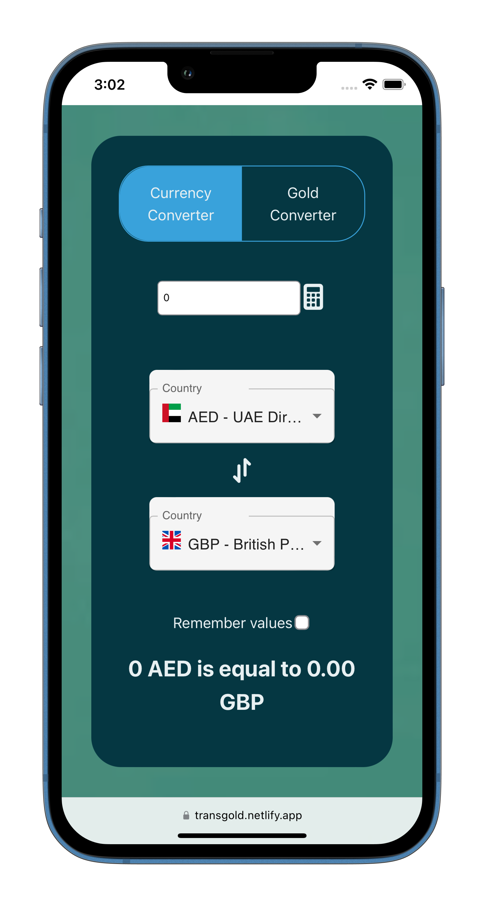
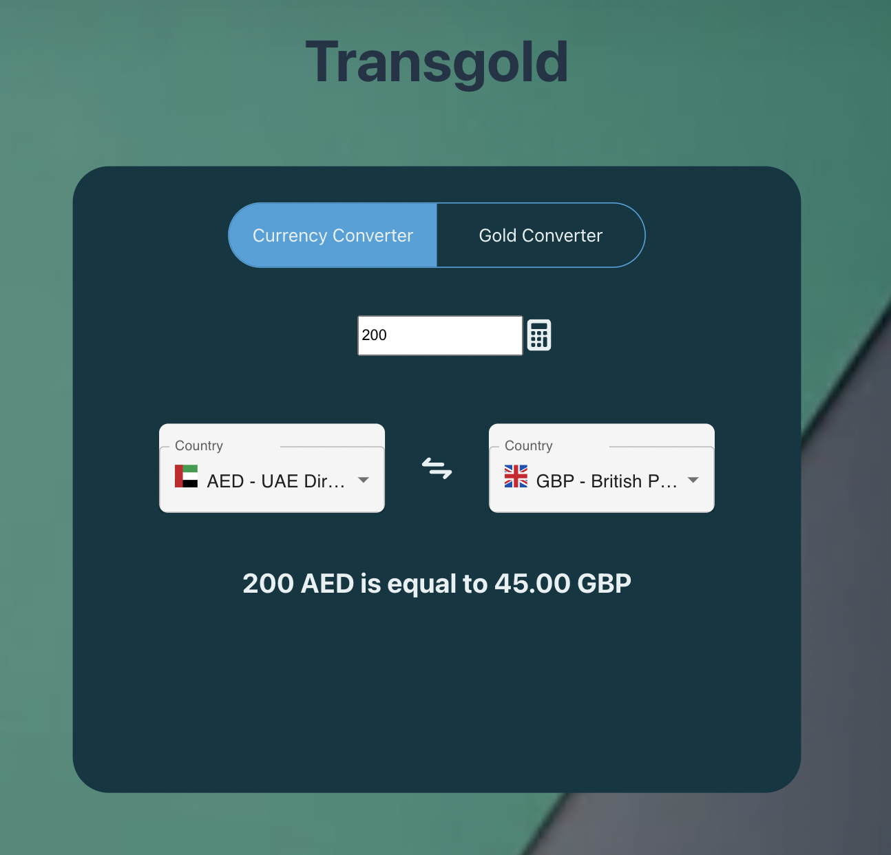

# transgold

This project was initialised using Vite TypeScript

 - live currency exchange rate
 
 - Keypad modal for mobile use

 - some Vitest testing has been added

This is a simple currency conversion app that allows users to select two currencies, a "from" and a "to" currency, and view the exchange rate between them. Users can input an amount in the "from" currency and instantly see the converted amount in the "to" currency. The app also includes a section for gold, which is currently under development.

To use the app, simply select the two currencies you want to convert between from the drop-down menus at the top of the screen. Then, input the amount you want to convert in the "from" currency and the converted amount will appear in the "to" currency field. Keep in mind that the exchange rates are updated in real-time, so you always have the most up-to-date information.

# Live site:
https://transgold.netlify.app/

NOTE: Project is not yet complete, but the Currency Exchange works fine

# Run the project locally 
to run the project locally, cd into 'travel_helper...
then *npm run dev*

